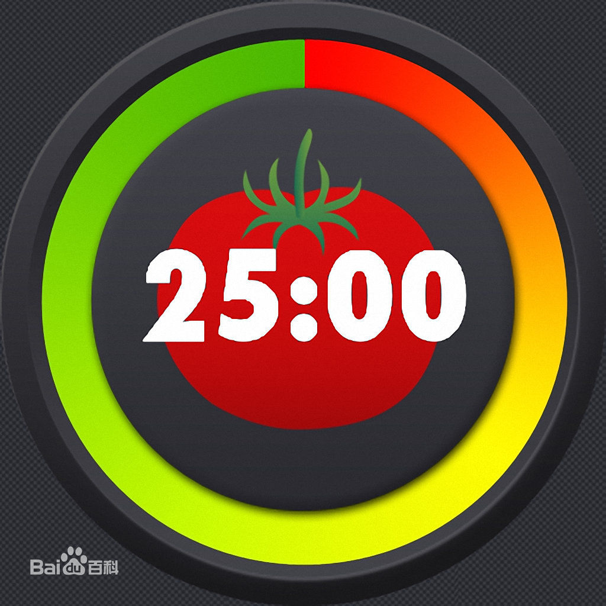
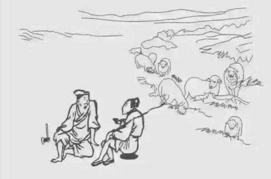
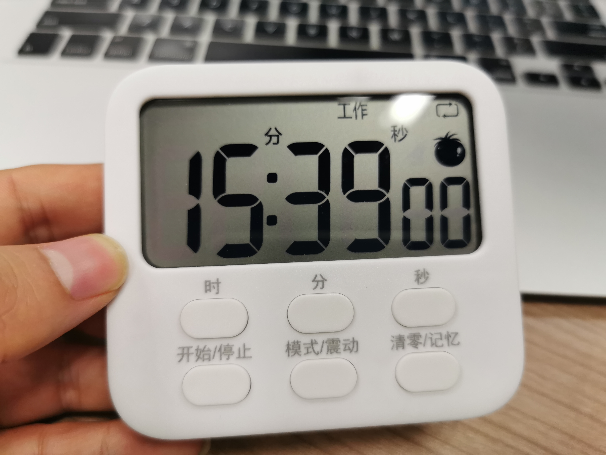
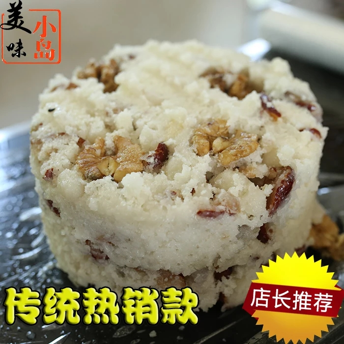

### 效率小工具-番茄闹钟

常有人问我：你一个程序员怎么这么闲，哪来这么多时间刷雪球？

有时候工作比较轻松是一方面，另外我觉得随着任务多了以后，怎么去合理的安排调度任务，让单位时间内办事效率得到提升，这个很重要。**如何高效的安排自己的时间，无论你做什么行业，这个都很重要。**

其实我从小就有蛮严重的拖延症，工作后有段时间我也很迷茫，感觉时间总不够用，怎么安排都不够，后来就发现了一个好东西叫‘**番茄闹钟**’。假设一个番茄是30分钟，前25分钟为工作时间，需要集中精力做一件事情，后面5分钟则可以休息一下。

早先都是靠自我约束，自己看下时间，然后集中工作约半小时，然后起身倒个水、上个厕所、吃个水果等。在这半小时内也就做一件事情，不受旁边事物的干扰，这样你做事的效率会高很多。

现在很多番茄闹钟的软件，还支持播放一些白噪音，可以让你更深度的沉浸于工作学习中，微信里也有不少类似的小程序。甚至有些好的软件会有激励机制或者成就机制，比如每完成一个番茄钟就会出现一颗小树苗，等树苗足够多了可以获得番茄成就徽章，也可以换成真的树木种植于沙漠地区。

程序员编程是一个需要高度集中精神的事，但日常工作中往往一会测试人员来找你问个事、一会产品经理来打扰你下、领导还有开不完的会要找你，这些都是影响我们工作效率的外在因素。**自己手上在做的事情被打断了，然后回头重新拾起来是很烦人的一件事情。**为什么程序员‘喜欢’加班？有时候是没办法呀，因为只有等晚上了业务和产品都回家了，你才能安静的、全身心的敲代码。

说到这个想起一个老段子：砍柴的看到放牛的躺在草地上休息就过去聊了会天，还越来越起劲，傍晚了放牛的牵着牛回家了，这时候砍柴的才发现自己还没砍到一捆柴。而产品和业务就是放牛的，我们就是那个砍柴的。

而且大部分的开发都有个小习惯，就是晚上不关机。因为你一旦关机了，第二天来上班把环境启动好，各种配置恢复成昨天的样子，或者平时你工作熟悉的样子也要消耗一点时间，所以大部分人除了不得已，下班一般不关机。

所以，让自己有个连贯的时间去学习也好、工作也好是很重要的，而这种25+5的番茄钟策略是很好。我们成年人也好、小朋友也罢，能够注意力高度集中的时间，差不多也就在25分钟左右，时间再长你就受不了，这也是为什么我们一节课的时间通常是45分钟。做的事情脑力思考部分越密集，那么注意力持续的时间越短，45分钟已经是极限了，通常上课过程中你也不会全程高度集中精力的。

5分钟休息是对前面25分钟密集劳动的一个奖励。那5分钟干嘛呢？平时工作坐在电脑边上，很少走动，颈椎也不好，那这5分钟就可以倒个水，上下厕所，看下邮件或微信有无需要紧急处理的事。

显然我们一天8小时工作不可能全部排满了番茄，这个体力上是不现实的，而且会导致总体效果也不好。我通常会选择午睡后的一段时间集中搞几个番茄钟（比如下午2：00 ~ 5：00），充分利用好这3小时内的6个番茄钟，可以完成这一天大部分的高脑力工作，剩余的时间其实可以安排一切轻松的事情。比如我喜欢在1：30 ~ 2：00罗列下今天6个番茄需要完成的任务，而5：00后就可以吃点下午茶，上上网舒缓下。

所以通常我能把上午挤出来做一些自己的事情，看看盘、聊聊天、列下写稿子的提纲。当然工作比较紧急的时候，那是另外一回事情，但大部分还是能够通过下午的这三个小时就可以完成。

番茄时钟软件是不错，但每次去看手机，势必会分散自己的注意力，因为我们都知道现在的手机有太多的信息和诱惑了，摸下手机5分钟就没了。当你打开番茄软件的同时，你也会被一些信息干扰，这样不利于你这个番茄的持续和番茄的效率。这也是很多人喜欢kindle的原因，因为手机或平板看电子书一个是伤眼睛，还一个就是会被打扰，读书往往需要不被打扰。

所以我在淘宝上买了一个电子番茄闹钟。它可以立在桌子上，也可以吸附在白板上或任何铁片上；它可以滴滴声提示也可以震动提醒；它可以设置单一番茄也可以设置番茄循环；遇到突发事件可以暂停和继续番茄钟；当然也可以设置每个番茄的工作和休息的时长；还附带了时钟功能、倒计时功能、闹钟功能。

我使用下来感觉很好，我也挺感谢雪球这个平台，感谢那么多粉丝的关注，托大家的福平时瓶盖也捡了不少。今天除了分享一些我安排时间的方法，也想给粉丝送点小礼物（一周后）：

1、选一个我认为最好的评论，送一个上面说的电子番茄闹钟小玩具。

2、点赞数第一名的，送一份崇明特产：崇明糕（3斤装）。【为什么是这个礼物，等我后面写拼多多的时候大家就知道了】

3、打赏若干钢镚给用心回复的朋友们。

我不喜欢强求转发和圈人，我觉得认真看文章就是对我最好的认同。如果能给大家带来一点小玩具、小零食我也很开心，虽然真的也不值几个钱，如果效果可以，后面不定期还会搞一点类似的小礼物。因为我觉得看我写理财的文章大家是来获取信息的，但看我闲扯的文章纯粹是对我本人的一个鼓励，最后再次感谢大家的阅读。

那评论的内容是什么呢？

百无禁忌，但能获奖的肯定是和管理时间、提升效率有关。可以是小贴士、可以是小工具的介绍、或其他相关也可；对我本人的一些有意义的建议和要求也是可以的。

