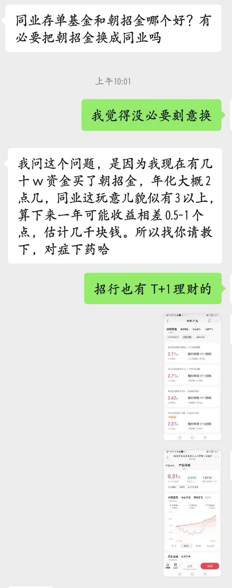

### 同业存单基金还是要按需购买

上午小区全员核酸回到家刚坐下就一位前同事问我：有必要把朝招金换成同业存单基金吗？我的回答是：没有必要刻意去换！（详见下图）

当然后面我们也聊了一会，现在简单地做一个整理与大家分享下。他有一笔几十万的钱买了招行的朝招金（招商银行的一款T+0产品），他说年底前大概率是用不上了，但也不是100%说就一定不用。他对这笔钱的要求是足够稳，如果收益能高一点当然更好。

他最近看到很多同业存单基金的宣传，还跟我说同业存单收益有3.5%，和现在持有的朝招金比一年可以多赚几千，还把一篇文章转发给了我，我选取了该文部分截图如下：

我说大哥，这明明写的是近五年年化收益3.5%，那我还能说余额宝刚出来的那几年年化收益都是6%+，甚至逼近过7%呢！你再看近2年各类货币基金能有个2%就谢天谢地了，而且人家都把华夏基金的产品代码都贴出来了（我手动打码了一下），显然这是一篇有立场倾向性的广告文呀（我能理解自媒体有商务的需求，但我觉得读者应该具备自我辨识的能力）。

另外我要指出的是，虽然第一批同业存单基金好多都因到了上限后时常限购，但非要买的话我肯定还是会选第一批那几只。因为以华夏基金为首的第二批6只同业存单刚发行，中间还夹了个五一长假，那么对于分毫必争的利息收益产品这时间损耗还是蛮大的，大家非要买第二批我也建议至少等个一个月再说。

我给他的建议是：你既然已经买了招行T+0产品，那么没必要在这个时间点腾挪同业存单了，毕竟收益差距也没那么大（以招行APP可买的鹏华同业存单基金为例，近三月收益为0.58%，简单推导下一年约2.32%，虽然不是很严谨但这已经是现有的最大区间展示收益率了），而且你要是觉得收益低可以买T+1的就会稍微高一点，再如果你对流动性要求没那么高可以选择一些季度、半年为周期的银行理财。

另外我也和他说了另外一个方案：如果能承受一些波动，那可拿一部分钱当下一次性买入沪深300和中证500指数基金（有点固收+ 的思路），然后在年底前只要有个3%的收益就立马卖出止盈，我认为当前的点位（上午那会还是2900多点哈）在今年剩余的时间内还是有极大概率博得这3%收益的，一次性就拿下了原本你想得到的那点利息收益。当然我最后还是再次强调，这是基于你自己能承受一定的风险，且认可我给你的这个策略思路。

-------- 我是一条正经分割线 --------

和这个朋友聊完后，我仔细想了下这同业存单到底有什么实在一点“实惠”之处，对，就是没套路的干货的那种实惠。

**支付宝黑卡会员每月无风险套利**

这个其实早在3月2日我已经发过一次，黑卡V1会员每月会有4张25元的券（V2、V3更多），以前买一些产品会有波动风险，现在该券对同业存单基金放开了，那么这就是妥妥的无风险薅羊毛。而且支付宝的黑卡会员也比较容易，30万资产基本都能达到，更多资金的话就会等级更高、优惠也更多。顺带说下黑卡还有话费抵扣、免费星巴克、加油费抵扣等实实在在的优惠（我认为比招行金葵花福利有诚意），之前帖子详见下图：

**同业存单产品给基金公司贡献“非货基”规模**

自从去年一季度开始协会定期发布各渠道和基金公司的规模排行后，让原本就很卷的基金业也更是卷得飞起。而当年余额宝规模破万亿后业内也就造了一个新词“非货基规模”，现在这同业存单基金就算在非货基范围内。

我们也看到第一批的几只同业存单基金规模几乎都是顶着上限运行，对于很多中小型的基金公司来说规模突然多了100亿那肯定是值得“开心”的一件事。至少有时候可以拿此作为一个宣传点，毕竟很多人也不知道你这个非货基规模里真正的权益规模有多少比例？

对于这类没啥操作难度且差异不大的产品，两批阵型都是大、中、小三类基金公司雨露均沾。我认为这是挺好的，上面也很照顾小基金公司了，对于小基金公司来说未来五年能很好地活下来可能是重要的事。

最后我想说：同业存单基金是不错的货基替代品，但大家也不要太神话它，按需购买即可。

