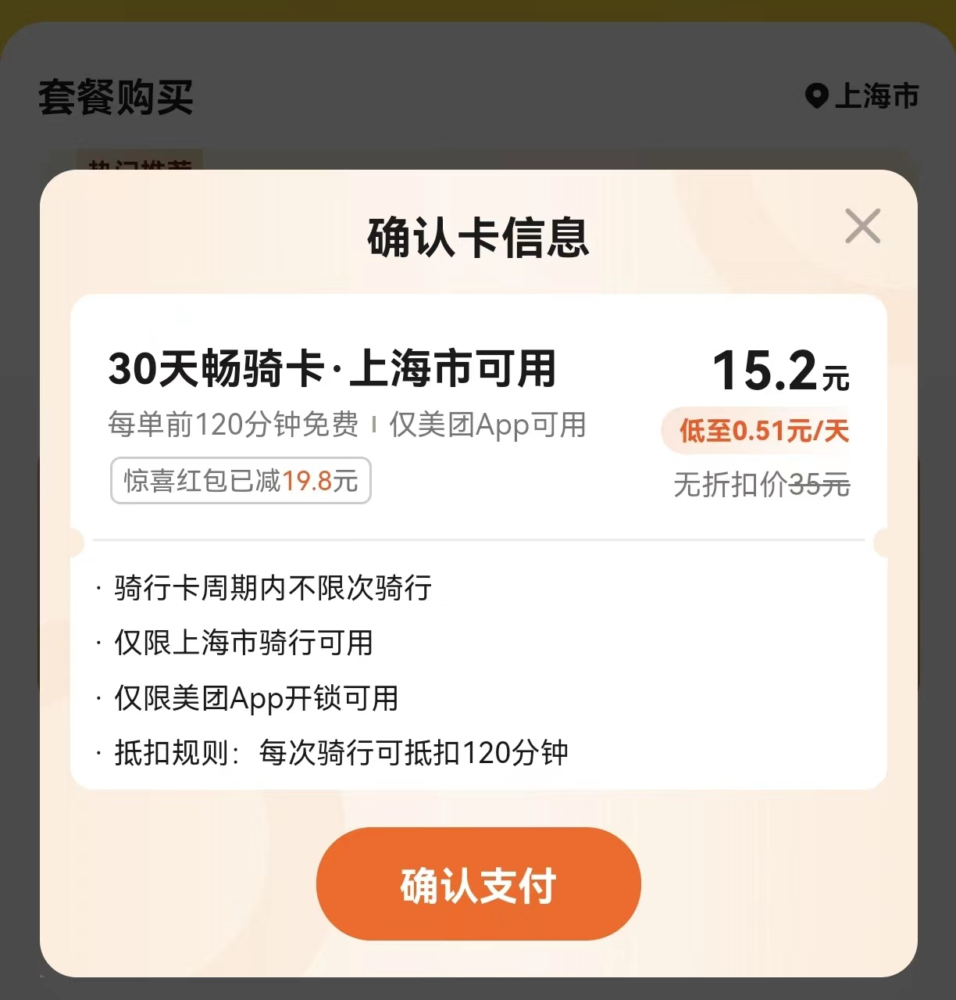
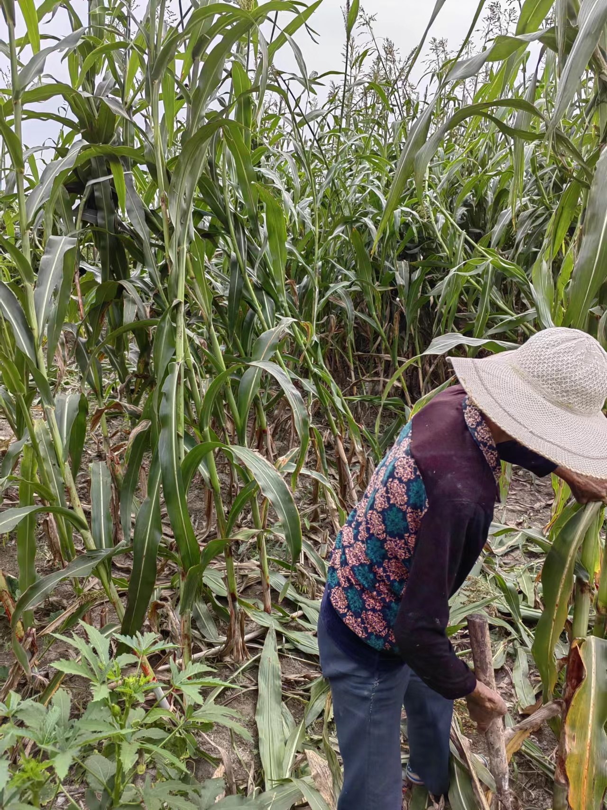
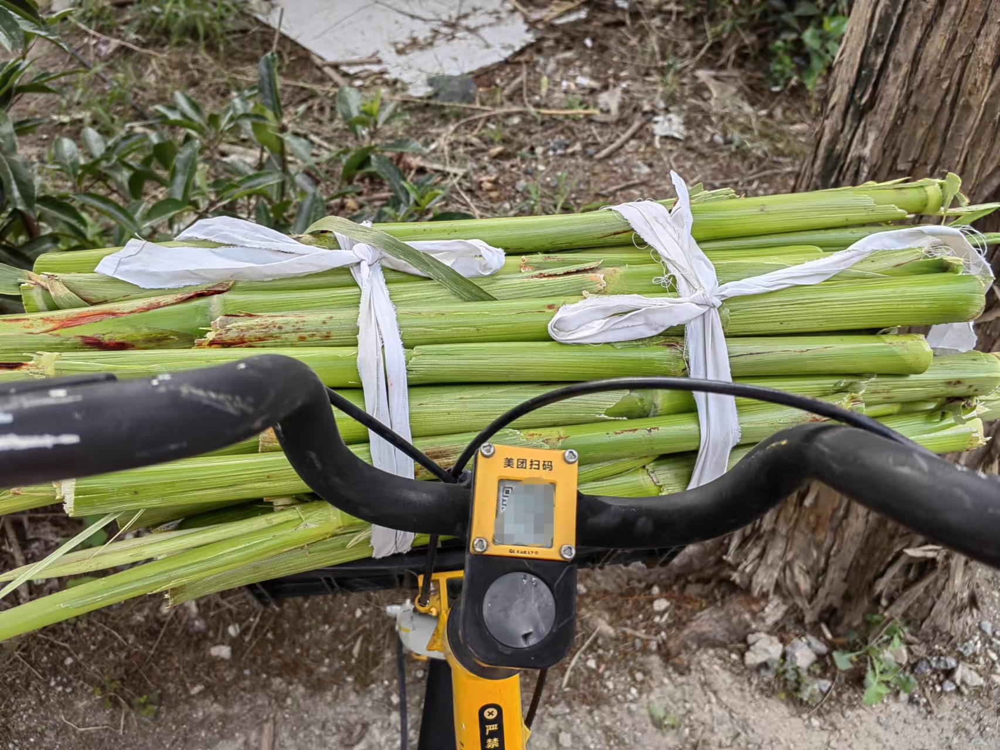
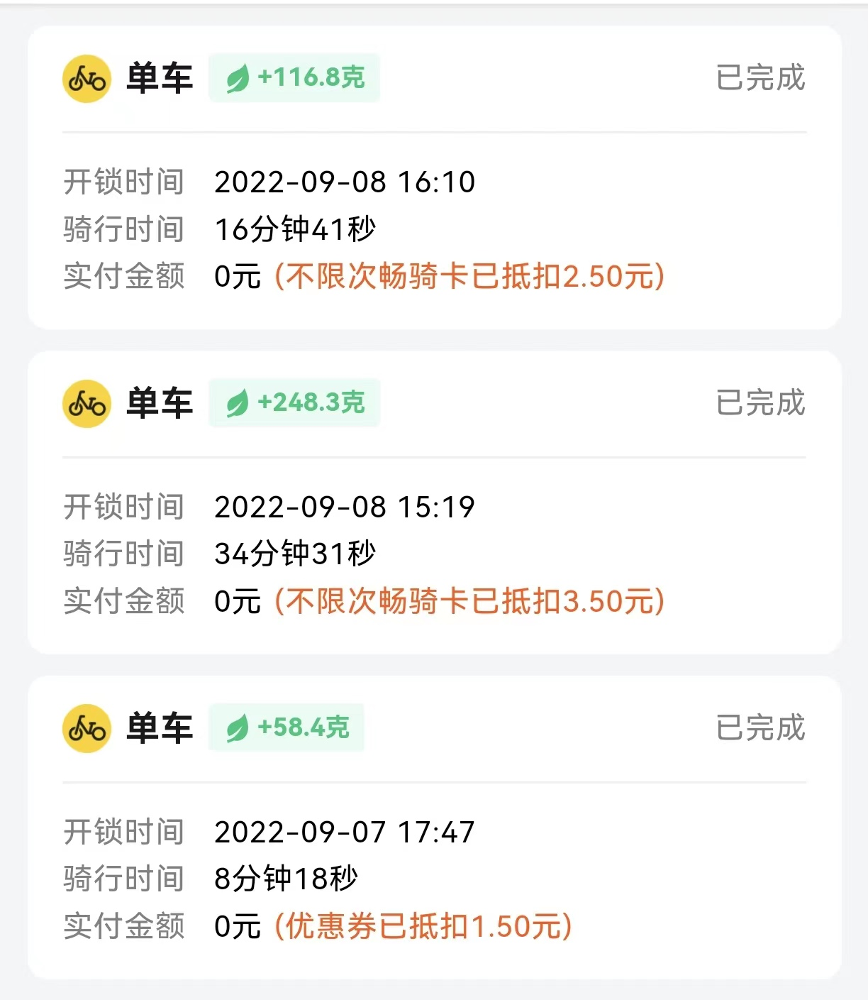

### 收盘后的一次闲散骑行

昨天回来得早，地铁口出来扫了辆美团共享单车去羽毛球馆看女儿训练，到了一看美团给我免单了（因为很久没骑了，老客返场福利券）。在等女儿下课的时候我在想：貌似真的很久没骑车了，春天防口罩、夏天怕酷暑，现在这初秋微凉恰是好时机。

正好美团共享单车买月卡搞活动只要15.2元（全国通用卡略贵一点），今天收盘后望着肚子上的肉，一狠心我就买了张月卡（不包月感觉骑不起小黄车了）。挎个小包放入手机、钥匙、小水壶、口罩、纸巾就出门了（下次还要多带个一两百的现金），本想着骑车到老婆公司，然后坐她的顺风车回家。

天气不热，三四点的上海郊区还有微风吹着挺凉爽，马路上的扬尘不少，即便没疫情我想自己也会戴个口罩的。一路骑行看到路边单车还是蛮多的，基本上公交站台、地铁站出口、小区门口等都会有共享单车，我看到的主要是滴滴的青桔和美团的小黄车。

骑到半路看到一老头扶着把简陋的木梯，梯上的老太正要翻过围墙，木梯旁还有两捆芦粟（我们启东人称之为芦稷，应该算是沙地地区的一种特产了）。这东西我是比较无感，但老婆很喜欢，所以停车问这老两口芦粟卖不卖？老太闻声热情地说：小伙子你翻过来，到里面自己挑、当场砍、包甜包好吃。

这东西在老家都是自己种自己吃，邻居家地里要是种了想吃点也是打声招呼的事，我以前还真从没买过。问了老太说粗的5元一根、细的4元一根，凭我的经验感觉有点小贵了（后来从保安小叔的口中验证了确实稍微贵了一点点），但看着老人家挣点辛苦钱我也就没还价。

我猜他们应该没收款码，特意在砍之前向她确认我今天没带现金能否手机支付？老太一边砍一边看向我说：没事，等会找路对面保安亭里的小伙子扫码下就行了。砍完初步修整长叶后，老太拖着一捆芦粟娴熟地翻过了围墙，我小心翼翼地跟在后面。到了马路对面，让保安小叔帮忙扫码后，老太帮我把6根芦粟切成段捆扎好，带着这一大捆东西想想还是终止骑行，今天先原路返回吧。

买完后和老婆说了这事，她惊讶道：这条路我每天要来回走，怎么就没发现过还有一块芦粟地？我说：有些风景在车里你是欣赏不到的，隔着个围墙要不是我今天看到这对老人，也很难发现。

现在家里买菜基本都是超市或者网上买，刚毕业来上海那会一来是网购买菜还没有、二来是为了省点钱，经常会在菜场门口的大爷大妈那买点当季蔬菜。买他们的菜你看着价格比菜场里便宜，但因为不是标准化的菜，回去以后剔除杂质也是蛮麻烦的。

而且这些本地菜农也有“狡猾”的，看到一些小年轻也会乱报价格或者在份量上做一些小手脚。即便如此只要价格不是很离谱，菜品不是很恶劣我都会尽量买一些，因为自己也是农村出来的，农民种了一点菜会把相对较好的拿到镇上去卖。在天黑前把菜卖光是个很开心的事，要是顺带耍了点“小聪明”卖了个高价格，回去告诉老伴两人能开心大半天。

在不给自己添加太多麻烦的情况下，能举手之劳后让种地人多一点点快乐，那也是蛮不错的一件事。文章写道这让我想起了前两天看到的一句毒鸡汤：如果真的勤劳致富，那么最富有的很可能就是农民。

